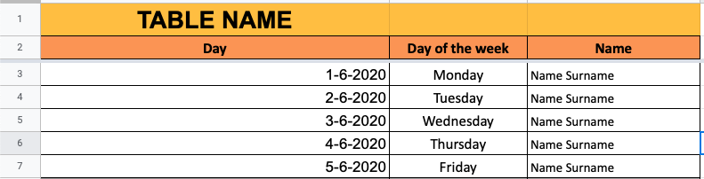
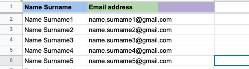

# GoogleSheetEMailSender 
## Script to automatically send emails from Google Sheet forms.

* [General info](#general-info)
* [Technologies](#technologies)
* [Setup](#setup)

## General info
This project is Google Sheets script which automatically send email messages to users.
The script compares dates and send email to the person which were assigned to the date.
	
## Technologies
Project is created with:
* App Script
* JavaScript
	
## Setup
To use this script you have to:

1. Make a new Google Sheet file and make two sheets in it.
2. You need to name the sheets as follows: "Calendar" and "emailAddresses" (without quotation marks).
3. The "Calendar" sheet has to look like screenshot below:

* In the A ("Day") column you have to write a date when scritp should send the e-mail.
* OPTIONAL In the B ("Day of the week") you can write a day of the week, when the script should send the e-mail.
* In the C ("Name Surname") column you have to write name and surname of addressee.

4. The "emailAddresses" sheet has to look like screenshot below:

* In the A ("Name Surname") column you have to write name and surname of addressee.
* In the B ("Email Address) column you have to write a e-mail adresses for each addressee. 

5. Than, you have open the script editor from: Tools -> Script Editor and make a new project.
6. Next, go to my GgSheetEMail repository, copy entire script from it (EmailSender file) and paste it into the script editor.
7. Than, save it and name your script.
8. Now you have to make a triggers. Go to Current project's triggers from Edit menu and make Add Trigger.
9. There you have to set options as follow:
* "Choose which function to run to" set to "CheckColumnDate"
* "Which runs at deployment" set to "Head"
* "Select event source" set to Time-driven
* "Select type of time based trigger" set to "Day timer"
* "Select time of day" set the time when the script should send the e-mail.
and save it.

10. Than you have to give all permisions for script to run on your Google account. 

That's all. :)

